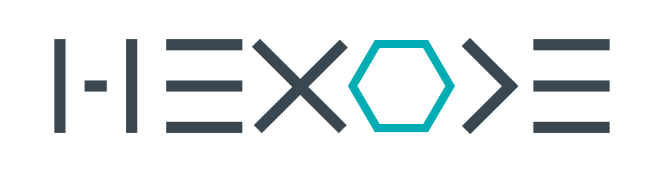
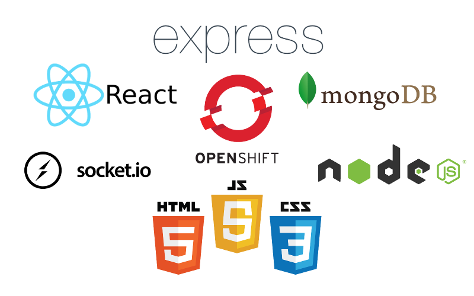

    
    

--------------------------------

    

--------------------------------

    <a href="SPECIFICATIONS.md">Specifications</a> | 
    <a href="http://14plumes.github.io/Hexode/backend/api">API Documentation</a>

    

    

