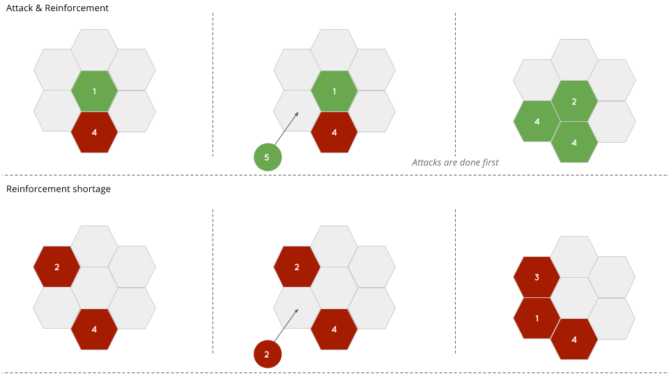

Concept
===========

## Game

### Rules
Rules are simple. Two players are trying to take control of a randomly generated map, divived
in hexagonal zones. 
To do so, each player plays turn by turn a same amount of turns.
Both players start with a given amount of entities, say 50. The number of total turns is
determined by advance and known of both players. At each turn, a player may choose to place a
given number of entity on a free zone (meaning that no other entity is already occupying the
zone). A minimum of 1 entity and a maximum of 6 entities could be placed. 

Once the player has made a move, the game will evolve accordingly to three rules, in that order:

- The selected zone now belongs to the player which did the move. This should be clearly
  identified by a color, a marker or whatever

- Each adjacent zone controlled by the opponent and for which, the amount of entity is
  strictly lower than the played zone's amount of entity is converted to the player which did
  the move, including the entities that are on the zone

- The played zone may also transfer one entity to each adjacent zone that was controlled by the
  player before making the move (the newly converted zones are not concerned). This is done for
  each adjacent zone or until there is only one entity remaining on the current zone. The
  reinforcement will be made starting by the zone in the upper right corner and doing a
  clockwise turn around the zone. 

The game is over when all turns have been played, even if a player might still possess unplayed
entities. The score is computed depending on two things: 

- The number of controlled zones
- The total number of entity, placed on the map, and under control

The player with the highest score win the game.

### Schemes




## Users

A user will refer to the first ressource of the application. A user account is basically a way
to give player a way to persist their identity. In order to keep it simple for the MVP, a user
will be the association of a nickname and a password. 

## Lobby

Once a user has specified a name, he's able to see a lobby with currently available games. A
game is defined by an id - possibly a name - and also a password if required. Any user in that
position could create a new game, set a password and wait for another player. A unique url
should also be available to allow the opponent to quickly join the game. 
If more than two players tried to connect to a game instance, the first two are accepted while
the other are refused and redirected to the lobby. 
If a player leave the game before the end, he should be able to reconnect and continue the
game. However, the game isn't persisted. Meaning that the game exists only during its ongoing
lifecycle and is deleted / unacessible once finished.


Application
===========

## Features briefly

### Authentication and account

- Ensure a user is authenticated 
- Create a new user
- Login a user

### Lobby

- Display a list of available game (with 0 or 1 player)
- Create a new game
- Delete a non-started game
- Automatically delete non-active abandonned games
- Join a game 

### Game

- Display a map of a default known shape
- Select an amount of entity to play
- Play an amount of entity on a zone
- Compute the score and close the game once finished

## Features in depth 

### Registration

In order to access the content of the application as the lobby and the game client, users have
to register and authenticate themselves. The authentication is done using an username and a
repeated password. This will create an account unless the username is already taken by an
existing user. To log in, a user would have to use those defined credentials. For the MVP,
there is no password recovery feature, and no way to change neither the password nor the
username. The process is really simple and should be effortless. 

### Authentication

Then, in order to login a user, the client might hit a specific endpoint of the api in order to
retrieve an access token. That token should then be transmitted through the appropriate HTTP
header on each request. As the client is for the moment provided by the application server on a
special endpoint, a login "session" is terminated with that client (when the user close the
tab or the window on its browser). 

### Lobby

In its minimalist form, the lobby is a list of available games, with means to create a new game
that will be added to the list. A game might be deleted by any user that has joined the game
and unless the game has started (meaning that, in the case of a two players game, only the
first one - aka the creator - is able to delete the game). 
By the way, when a game is created, the user responsible for the creation is automatically made
a participant of that game (sending a join request will have no effect, the player has already
joined the game).

### Join a game

When a game is created, it is stored inside a database. In order to perform operations on a
game, the client needs to require an access token for that game in the similar way of what it
is doing for the user authentication. The api will then need to provide that token as an
authorization.  Requesting a token does not have any impact on the game object though. 

### Play a game

Once a client is in possesson of a game token, it is able to send request that will change the
state of a game. Those actions are parts of the API and can be reached as well through HTTP. 
Then, when making a change to a given game entity the server might also emit some event through
a socket bound a defined port. Events are split into channels and does not interfer - a channel
being nothing more than a game id. Several client might be listening on a channel and are then
able to update their states accordingly. Events are detailed in the next section.

### Game details

In order to keep it simple for the MVP, all games will firstly be shaped the same way. Meaning
that tiles belong to a predefined place accordingly to their id / position. The number of units
available units is fixed to 21 (1+2+3+4+5+6), the number of rounds to 12 as well as the number
of tiles. Players have to play all of their units in 6 rounds each (the player starting being
choosen randomly) in such a way that they cannot play twice the same amount of units in a same
game (they will have to play once 1 unit, once 2 units, etc...). 
The game can start only when two players have joined. If one player is disconnected, the game
will be paused until the player recovers its access. Once the game is over, no more action can
be performed on the game. 

Backend
=======

## Resources

### User

name       |  type   | comment
-----------|---------|--------
id         | String  | A user unique identifier in [a-Z0-9]
username   | String  | Also unique but with utf-8 characters
password   | String  | Encrypted user password
createdAt  | Date    | The date the user registered
updatedAt  | Date    | Updated each time the user connect to the game

### Game

name       |  type   | comment
-----------|---------|--------
id         | String  | A unique game identifier in [a-Z0-9]
name       | String  | The name of the game given by its creator
password   | String  | Encrypted game password
board      | String  | A serialized version of the board. The process is described below
createdAt  | Date    | The date the game was created
deleted    | Boolean | Games won't be deleted. This bool would rater be set.

### Board 

Board will be stored as a plain JSON object as an attribute of game's entity rather than being
stored in their own document. This choice is the consequence of several facts:

- We want to avoid creating a relation between two entities as we're gonna use a non
  relational data model representation (mongoDB)
- The size and the shape of a board is known by advance. The object cannot grow and is under
  control.
- The client will never try to access to a board object without being in the context of a game.
  Also, boards have no existence beyond the one of the game.

We'll thereby represent boards as JSON objects of the following shape:

```json
{
    "id": <String>,
    "name": <String>,
    "currentRound": <Number>,
    "currentPlayerId": <String>,
    "createdAt": <Date>,
    "tiles": [{
        "id": <Number>,
        "ownerId": <String>,
        "units": <Number>,
    }],
    "players": [{
        "id": <String>,
        "units": <Number>
    }]
}
```

## Routing

All routes are detailed in the [API documention](http://ktorzpersonal.github.io/Hexode).
Neverthless, a special behavior is associated to the default route `/`: this endpoint serves
the application client. The latter is handling all further communications with the application
backend. In fact, any other endpoints will be JSON-formatted responses (assuming that the
client is providing the right `X-Requested-With` header (without an appropriate header, the
application will just fail with an appropriate message and header).

## Events

In order to communicate changes to several clients, the server is able to send small
event messages through a socket on which is listening the game client. Events might contain
data giving details about the nature of the event. Except for the connexion and deconnexion
events, all events are being emitted from the server to the clients. Events are detailed below.

As a matter of fact, the server is in charge of sending events only to the effetive recipients.
Plus, it will also buffer emitted event is one the client isn't reachable at the emission time.
Once every client is reachable, buffered events should be consumed in the same order with a
small delay.

Here they are:

event       | params                | description
------------|-----------------------|-------------
start       | `()`                  | Sent when the game could start
disconnect  | `{ tileId: <String> }`    | Sent after a player has been disconnected
move        | `{ tileId: <Number>, units: <Number>, userId: <String> }` | Sent when a player makes a move

## Application structure

Here is detailed the backend application structure and all naming conventions presumed for the
development.

```
|- src
|---- config.js
|---- main.js
|---- models
|------- FirstModel.js
|------- SecondModel.js
|---- controllers
|------- first_controller.js
|------- second_controller.js
|---- routes
|------- first_router.js
|------- second_router.js
|---- lib
|------- lib_folder
|---------- index.js
|---------- whatever.js
|------- other_lib_folder
|---------- whatever.js
```

To sum up:

- Models are named `UpperCamelCase`
- Everything else is named `snake_case`

Frontend
========
The frontend application is divided in three main parts. Each of them are under different
restriction access. The frontend application in itself will be a small supervisor able to
switch between those parts while holding the application state mateliarize within tokens.  

By the way, the frontend application should take care of browser location menaning that each action
leading to a new screen should also be associated to a given URL in such a way that the user
should be able to use classical browser features to navigate into the game (previous page,
refresh etc...)

In a second time, the Frontend might take advantage of the cookie browser to store a cookie
holding the user or game token in such a way that any state of the application could be
recovered.

Furthermore, all requests to the backend are made through ajax meaning that once the client has
been downloaded, no other page will be triggered od refreshed.

## Unrestricted area
This section can be accessed by any user that is not logged in. Once authenticated, a user
won't be able to navigate again through this area unless he logs out.
This section is constitued of only one screen which handle a double role:

- Handle a user login through a simple form
- Offer the user a way to subscribe through an extended version of that form


Basically, screen states can be skteched as below:

**State 1**
```
-------------------------
- username:             -
-------------------------

-------------------------
- password:             -
-------------------------

     _____________
     |           |
     |   LOGIN   |
     |___________|

  > Create an account <
```

**State 2**
```
-------------------------
- username:             -
-------------------------

-------------------------
- password:             -
-------------------------

-------------------------
- password (bis):       -
-------------------------

     _______________
    |              |
    |   REGISTER   |
    |______________|

       > Login  <
```

The two links "create an account" and "login" are used to toggle the state and the main buttons
`LOGIN` and `REGISTER` actually perform a request on the backend to either create a new user
(and then log in that same user in a row) or get a valid user token after an authentication.

## Lobby
If a user token exists, then the user has access to an entire new part of the have (whereas
the previous section is now unavailable).
The lobby is also pretty straightforward and appears as a list of game names. Two global
features are available from within the lobby: create a new game and logout.  The lobby also
displays the current user username with a tiny sweet welcome message.

Periodically, the game list is updated (every 3s). There is for the moment no way to manually
refresh the list, users have to wait. After having created a game, a player might be
automatically logged in into that game. This implies that only one game can be played at a
time.

**state1**
```text
                      Have fun <username> or| LOGOUT |

Available games
 game #1                                   |JOIN|
 game #2                                   |JOIN|
 game #4                                   |JOIN|
 game #5                                   |JOIN|
 game #6                                   |JOIN|
 game #7                                   |JOIN|
 game #8                                   |JOIN|

  Willing to create your own game ? | NEW GAME |
```

**state2**
This shows up as an overlay after a click on the `NEW GAME` button

```
-------------------------
- game's name:          -
-------------------------

-------------------------
- password:             -
-------------------------

-------------------------
- password (bis):       -
-------------------------

| CREATE |     | CANCEL |
```

**state3**
This shows up after hitting a `JOIN` button, also as an overlay unless there is no password
assigned to the game. In such a case, the player is directly made join the game.
```
-------------------------
- password:             -
-------------------------

| JOIN |       | CANCEL |
```

## Game

The game is divided in three main states:

- **Paused** when the game hasn't started or more exactly, when a player is missing (meaning
  that a deconnection will lead back to that state).
- **Running** while the game is actually running. Thus, the game is staying in this global,
  each internal component of the game evolves and change state as well during the game.
- **Over** while the game is finished. No other state can be reached from that state, it is
  terminal.

**Paused**
```
    Waiting for the game to be ready. A player is still missing.

    
                        | QUIT THE GAME |
```

**Running**  
In the running state, the game might be updated thanks to event coming from the server.  Event
aims at making the game reactive. A player should clearly identify selected pack of units or
hovered tiles on the board. In a first time, the only event restransmitted through the socket
will be the `invade` event. In other word, only player moves are registered.  In a second time,
we could imagine trigger events each time a player is hovering a tile or a set of units to make
the game really interactive and reactive for both players at the same time.

The score is updated after each turn such that each player knows at any moment what is the
current score. Also, it could be nice to remind player how scores are computed with a little 
help box or something.

```
    <username1> | <score1>                          <score2> | <username2>

    ______________________________________________________________________
    |                                                                    |
    |                                                                    |
    |                                                                    |
    |                               BOARD                                |
    |                                                                    |
    |                                                                    |
    |____________________________________________________________________|

    
    Units
                ||||||   |||||   ||||    |||     ||     |
```

**Over**

```
        The game is over. 

___________________________________
|                                 |
| USERNAME1 WINS WITH XXXX POINTS |
|_________________________________|

      | BACK TO THE LOBBY |
```

## State-tree

On the frontend-side, the application will rely on *Redux* which is a simple framework that
gives us the ability to represent the app as plain JavaScript object. This object is called a
state an represent the ... state of the application. Because an application is rather complex,
the state is in fact divided into several sub-state suhc that we end with a tree so called
state-tree. The client is then nothing more than a visual representation of the state-tree.
User interactions may update the state and thus, provoke a new rendering of the state through a
new visual representation. 

Our state-tree will be the following:

```
{
    ----------------------------
    - Application Level / Common
    ----------------------------

    user: Null|{
        token: <String>,
        id: <String>,
        username: <String>
    },    
    pending: <Boolean>,
    notification: {
        status: <String={Error|Success|Info|Warning}>,
        content: <String>
    },
    validations: [{
        field: <String>,
        status: <String={Valid|Invalid}>,
        message: <String>
    }],
    
    ----------------------------
    - Lobby
    ----------------------------

    lobby: {
        games: [<String>],
        joinRequest: <Boolean>,
        createRequest: <Boolean>
    },

    games: [{
        id: <String>,
        name: <String>,
        maxPlayer: <Number>,
        nbPlayer: <Number>
    }]


    -----------------------------
    - Game
    -----------------------------
    
    game: Null|{
        token: <String|Null>,
        status: <String=Paused|Running|Over>,
        currentRound: <Number>,
        currentPlayerId: <String>,
        players: {
            id: <String>,
            username: <String>,
            units: {
                selected: <Number>,
                remaining: <Number>
            }
        },
        tiles: [{
            id: <Number>,
            ownerId: <String>,
            units: <Number>,
            hovered: <Boolean>,
            selected: <Boolean>
        }],
    }
}
```

## Actions

### Common

- `notificationRead () :: ~notification`

### Unrestricted Area

- `loginQuery () :f: ~pending`  
- `loginResolve (response) :: ~pending, ~user, ~notification`  
- `loginReject (error) :: ~pending, ~notification`  
- `registerQuery () :f: ~pending`  
- `registerResolve (response) :: ~pending, ~notification`  
- `registerReject (error) :: ~pending, ~notification, ~validations`

### Lobby

- `logoutRequest () :: ~user, ~notification, ~validations, ~loby, ~games, ~game`
- `gamesQuery (silent) :f: ~pending`
- `gamesResolve (silent, response) :: ~pending, ~games, ~lobby.games`
- `gamesReject (silent, error) :: ~pending, ~notification`
- `joinRequest () :: ~joinRequest`
- `joinCancel() :: ~joinRequest`
- `joinQuery () :f: ~pending`
- `joinResolve (response) :: ~pending, ~joinRequest, ~game, ~notification`
- `joinReject (error) :: ~pending, ~notification`
- `createRequest () :: ~createRequest`
- `createCancel () :: ~createRequest`
- `createQuery () :f: ~pending`
- `createResolve (response) :: ~pending, ~createRequest, ~game, ~notification`
- `createReject (error) :: ~pending, ~notification, ~validation`

### Game

// TODO

## Components

Alongside with *Redux*, the framework *React* will be used to build the client. *React* enables
a high modularity such that the client will be split in several smaller independant components.
All those components could and should be developed and be tested separately. 

Right below are components that are roughly implied from the section above. Each of them should
constitute a single task of development. Each component also comes with a specific pre-defined
css style in such a manner that they could be imported and be fully functional. 

Not all components would be detailed here. Some of them are higher-level containers and other
one might be created on purpose during the development (if one of the following components
needs to be reffined).

### Common

// TODO

### Unrestricted Area

// TODO

### Lobby 

// TODO

### Game

// TODO

## Containers

// TODO

## Application structure

Here is detailed the frontend application structure and all naming conventions presumed for the
development.

```
|- src
|---- index.jsx
|---- actions
|------- index.js
|------- common.js
|------- unrestricted\_area.js
|------- lobby.js
|------- game.js
|---- components
|------- Component1.jsx
|------- Component2.jsx
|------- Component3.jsx
|------- Component4.jsx
|---- containers
|------- UnrestrictedArea.jsx
|------- Lobby.jsx
|------- Game.jsx
|------- App.jsx
|---- reducers
|------- index.js
|------- common.js
|------- lobby.js
|------- game.js
|---- styles
|------- component1.scss
|------- component2.scss
|------- component3.scss
|------- component4.scss
|---- vendor
|------- library1
|------- library2
```

To sum up:

- Components and Containers are named `UpperCamelCase`
- Everything eslse is named `snake_case`
